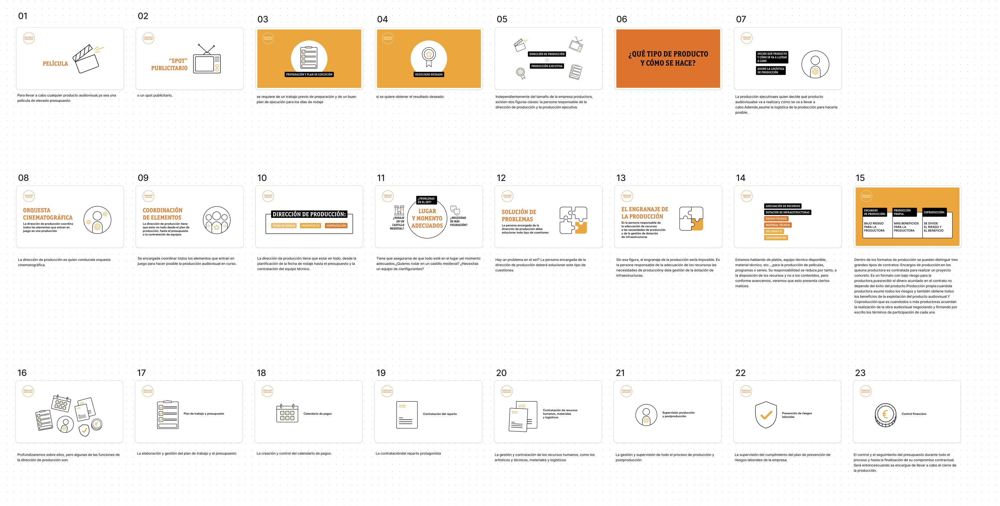
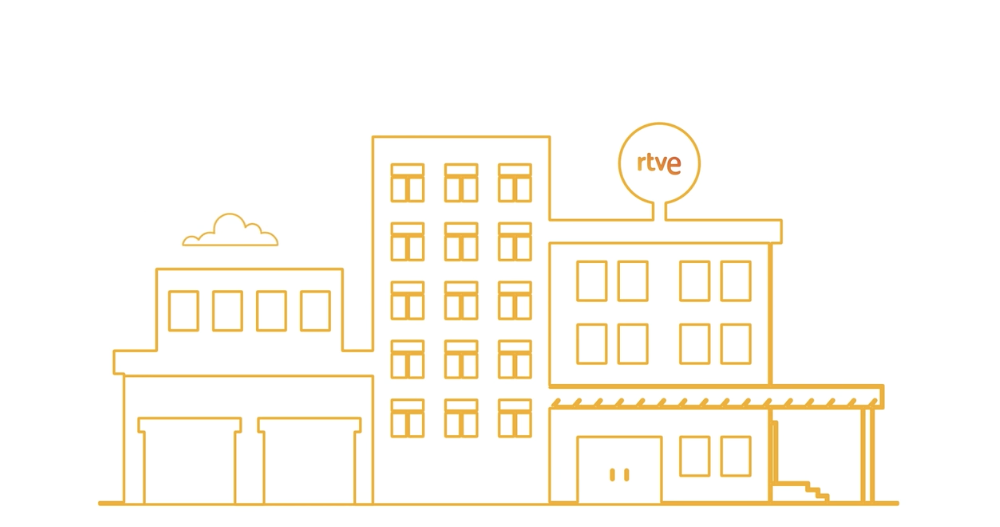
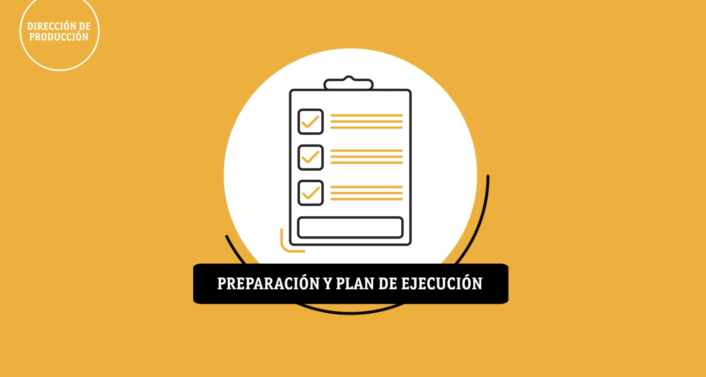
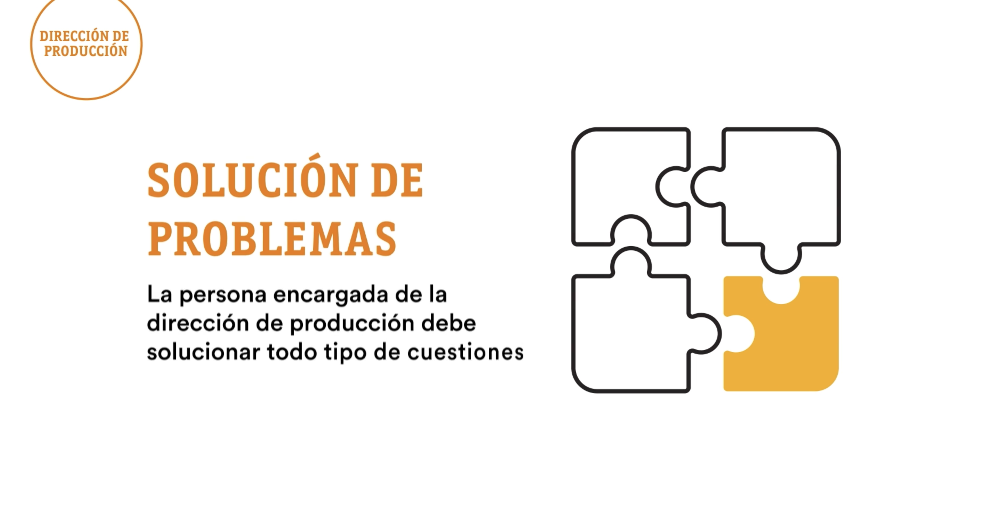
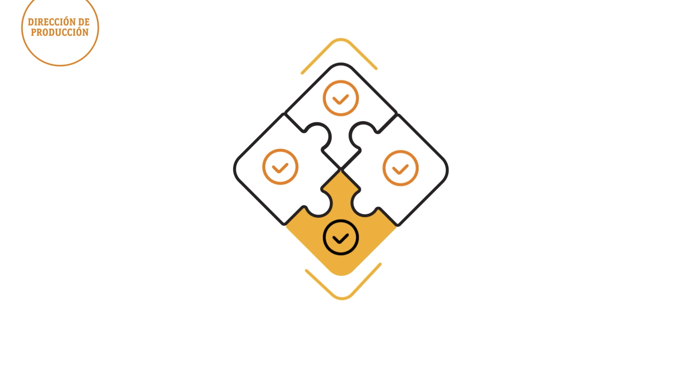

# RTVE Instructional videos

Collaborating with RTVE on their Master's program in Television, Broadcasting, and Communication offered a distinct and valuable opportunity to make a significant impact on the training of future professionals in the media industry. RTVE, being the Public Spanish Television, has a commitment to providing high-quality education through practical and theoretical learning. In this context, my contribution involved the production of instructional videos, leveraging my expertise in After Effects, motion graphics, and post-production to create content that is both engaging and educational.

[Watch Video](https://vimeo.com/924327039?share=copy)

### My Role

In my capacity as a senior communication designer, I took on the responsibility of designing and animating over 30 videos tailored to the intricate aspects of television, broadcasting, and communication. My responsibilities spanned from the inception of concepts through to the final touches of animation and post-production. The aim was to produce content that not only educates but also captivates students, simplifying complex principles of broadcasting and communication. The covered subjects ranged from interview techniques, storytelling, content production, editing workflows, to comprehensive tutorials on using industry-standard software such as Figma for designing broadcast graphics. My role necessitated a combination of technical prowess in motion graphics and an in-depth understanding of broadcasting and communication theories to effectively convey these topics through the medium of video.

### Design Process

The process of creating these instructional videos entailed several crucial phases:

1. **Content Development:** The initial step involved collaboration with instructional designers and experts in the field to delineate the content for each video. This partnership was vital to ensure that the videos accurately reflected the principles of broadcasting and communication and met the educational goals of the curriculum.

2. **Storyboarding and Scripting:** I devised storyboards and scripts for each video, establishing the visual and narrative trajectory. This phase was critical for determining the most effective way to present complex information engagingly and comprehensibly.

3. **Design and Animation:** Guided by the storyboard and script, I advanced to the design and animation stage. Utilizing After Effects, I crafted motion graphics that animated the content, paying close attention to rhythm, visual hierarchy, and animation techniques to foster better understanding and memory retention.

4. **Voiceover and Sound Design:** The visuals were complemented by voiceovers and sound design, choosing tones and voices that would engage the audience and enrich the learning experience.

5. **Post-Production:** The concluding phase encompassed post-production efforts, where I adjusted colors, ensured audio clarity, and refined animations to achieve a professional quality.

6. **Feedback and Iteration:** I engaged in several rounds of feedback with the instructional design team and conducted pilot tests with a segment of the target audience. This iterative approach allowed for the refinement of the videos, ensuring they were both informative and compelling.

7. **Delivery and Evaluation:** The completed videos were then incorporated into the Master's program curriculum. I also took part in evaluating their effectiveness, measuring student engagement and understanding to guide future content creation.

Contributing to RTVE's educational initiatives was immensely gratifying, allowing me to merge my expertise in motion graphics and communication design with a passion for education. By developing content that was visually striking and pedagogically robust, I aimed to enrich the learning experience for students, demystifying complex concepts in broadcasting and communication. This project was more than just producing educational materials; it was about equipping the forthcoming generation of media professionals with the essential knowledge and skills for their future success.

